# 📜 RAG System for Historical & Tourism Q&A

**Automated Q&A System with RAG (Retrieval-Augmented Generation) for Vietnamese History & Tourism**

A production-ready AI system that combines real-time web search, vector database retrieval, and large language models to provide intelligent answers about Vietnamese history and tourism.

---

## 🎯 Features

✅ **Multi-language Support** - Vietnamese, English, Chinese, Japanese, Korean, Thai  
✅ **Role-based Responses** - Traveler, Student, Researcher, Enthusiast personas  
✅ **Automatic Map Integration** - Extract and display coordinates on interactive maps  
✅ **Conversation Memory** - Per-user conversation history for context-aware responses  
✅ **Hybrid Search** - Vector search + Keyword search (Reciprocal Rank Fusion)  
✅ **Web Fallback** - Automatic external search when local data is insufficient  
✅ **Daily Auto-crawler** - Scheduled background crawler for knowledge base expansion  
✅ **Production Ready** - Docker support, comprehensive logging, error handling  

---

## 📋 Tech Stack

| Layer | Technology |
|-------|-----------|
| **Frontend** | React + TypeScript + Leaflet.js |
| **Backend** | FastAPI + Python 3.11 |
| **Vector DB** | Qdrant (semantic search) |
| **LLM Provider** | Perplexity AI / OpenAI |
| **Embedding** | Sentence-Transformers |
| **Web Scraping** | Wikipedia API + RSS Feeds |
| **Task Scheduler** | APScheduler |
| **Deployment** | Docker + Docker Compose |

---

## 🚀 Quick Start

### **1. Clone & Setup**
```bash

git clone <repo-url>
cd chatbot-history
python -m venv venv
```

Windows 
```
venv\Scripts\activate
```

macOS/Linux
```
source venv/bin/activate
```

### **2. Install Dependencies**
```bash

pip install -r requirements.txt
```


### **2. Environment Configuration**

Create `.env` file:
```env
 Qdrant
QDRANT_URL=http://localhost:6333
QDRANT_API_KEY=your-api-key

LLM Provider
PERPLEXITY_API_KEY=your-perplexity-key
OPENAI_API_KEY=your-openai-key

App Config
APP_NAME=RAG History Tourism
COLLECTION_NAME=history_tourism
VECTOR_SIZE=384
MAX_CONTEXT_DOCS=5
MAX_CONVERSATION_HISTORY=5
```


### **3. Run Qdrant (Docker)**
```bash

cd chatbot-history/docker
docker-compose up -d qdrant
```


### **4. Start Backend**

```bash

python -m uvicorn app.main:app --reload --host 0.0.0.0 --port 8000

or

python run.py
```


Backend available at: `http://localhost:8000`

API Docs: `http://localhost:8000/docs`


### **5. Ingest Data**
```bash

Full ingestion (all seed + auto-discover)
python scripts/ingest_crawler.py

Quick test (3 seed + 5 auto-discover)
python scripts/ingest_crawler.py --seed-limit 3 --auto-discover-limit 5

Only seed articles
python scripts/ingest_crawler.py --only-seed
```


### **6. Start Frontend**

```bash

cd frontend
npm install
npm start
```


Frontend available at: `http://localhost:3000`

---

## 📚 Project Structure

```

chatbot-history/
│
├── app/ # Main application
│ ├── init.py
│ ├── main.py # FastAPI app + scheduler initialization
│ ├── config/
│ │ └── settings.py # Environment & app settings
│ ├── db/
│ │ ├── qdrant_client.py # Qdrant operations (search, ingest, save)
│ │ └── conversation_store.py # In-memory conversation storage
│ ├── routes/
│ │ ├── ask.py # Main Q&A endpoint
│ │ └── health.py # Health check endpoint
│ ├── services/
│ │ ├── factory.py # Get embedder/generator instances
│ │ └── external_search.py # External web search fallback
│ ├── data_ingestion/ # Crawler pipeline
│ │ ├── enhanced_pipeline.py # Main ingestion pipeline
│ │ ├── auto_crawler.py # Auto-discovery from categories
│ │ ├── wikipedia_scraper.py # Wikipedia data collection
│ │ ├── web_scraper.py # RSS feed scraping
│ │ ├── data_processor.py # Text cleaning + chunking + embedding
│ │ ├── deduplication.py # Duplicate detection
│ │ └── sources/
│ │ ├── historical_sources.py
│ │ └── tourism_sources.py
│ ├── scheduler/
│ │ └── crawler_scheduler.py # Background scheduler (daily crawl)
│ └── utils/
│ ├── context.py # Context building + language detection
│ ├── role_prompts.py # Role-specific prompts
│ └── conversation.py # Query rewriting, conversation history
│
├── scripts/
│ └── ingest_crawler.py # Manual ingestion script with parameters
│
├── frontend/ # React application
│ ├── src/
│ │ ├── components/
│ │ │ ├── MapView.jsx # Leaflet map component
│ │ │ ├── ChatInput.jsx
│ │ │ ├── ConversationHistory.jsx
│ │ │ ├── Message.jsx
│ │ │ ├── RoleSelect.jsx
│ │ │ └── ModelSelect.jsx
│ │ ├── pages/
│ │ │ └── ChatbotPage.jsx # Main chat interface
│ │ ├── api/
│ │ │ ├──askService.js # API calls
│ │ │ ├── conversationService.js
│ │ │ └── index.js
│ │ ├── utils/  # Utility functions
│ │ │   ├── language.js
│ │ │   └── uuid.js
│ │ ├── App.css          # Global styles
│ │ ├── App.jsx          # Main React app component
│ │ ├── main.jsx         # Entry point
│ │ └── styles.css # Styling for components
│ └── package.json
│
├── logs/ # Application logs
│ └── ingestion_*.log
├── crawled_history.txt # Track crawled articles
├── requirements.txt # Python dependencies
├── docker-compose.yml # Docker compose setup
├── Dockerfile # Backend container
├── .env # Environment variables
└── README.md # This file
```


---

## 🔌 API Endpoints

### **1. Ask Question**

**POST** `/ask/`

Request:
```json
{
    "prompt": "Chùa Một Cột ở đâu?",
    "model": "openai",
    "deepResearch": false,
    "user_id": "user123",
    "tenancy": "traveler",
    "top_k": 5,
    "use_keyword": true
}
```


Response:
```json
{
    "prompt": "Chùa Một Cột ở đâu?",
    "answer": "## Chùa Một Cột\n\nVị trí: Hà Nội...",
    "sources": [
  {
    "title": "Chùa Một Cột",
    "url": "https://vi.wikipedia.org/...",
    "score": 0.92,
    "answer_snippet": "..."
  }
  ],
    "conversation_id": "user123-memory-session",
    "mode": "rag",
    "language": "vi"
}
```


### **2. Health Check**

**GET** `/health/`

Response:
```json
{
    "status": "healthy",
    "database": {
        "status": "connected",
        "documents": 1250,
        "collection": "history_tourism"
    },
    "scheduler": {
        "status": "active",
        "jobs": [
            {
                "id": "daily_crawl",
                "name": "Daily Crawler Job",
                "trigger": "cron[hour='2', minute='0']",
                "next_run": "2025-11-02T02:00:00"
            }
        ]
    }
}
```


### **3. Get Scheduled Jobs**

**GET** `/api/scheduler/jobs`

### **4. Trigger Crawl Manually**

**POST** `/api/scheduler/run-crawl`

---

## 🔄 Crawler Usage

### **Basic Commands**

```bash

python manual_expand.py --limit 50 --max-per-category 10
```

### **Parameters**

| Parameter | Type | Default | Description |
|-----------|------|---------|-------------|
| `--seed-limit` | int | None | Limit seed articles (None = ALL) |
| `--auto-discover-limit` | int | None | Limit auto-discover articles |
| `--max-per-category` | int | 50 | Max articles per category |
| `--only-seed` | flag | False | Skip auto-discovery |

```mermaid
graph TD
    subgraph "Bước 1: Khởi chạy (manual_expand.py)"
        A[/"Chạy lệnh:<br>docker compose run --rm crawler<br>python manual_expand.py --fetch-rss"/] --> B("<b>manual_expand.py</b>: main() được gọi");
        B --> C{"Parse các tham số dòng lệnh<br>--fetch-rss=True<br>--max-per-category=50<br>..."};
        C --> D["Khởi tạo <b>EnhancedIngestionPipeline</b>"];
    end

    subgraph "Bước 2: Khởi tạo Pipeline (enhanced_pipeline.py)"
        D --> E["- Khởi tạo <b>WikipediaScraper</b> & <b>WebScraper</b>"];
        E --> F["- Khởi tạo <b>DataProcessor</b>"];
        F --> G["- DataProcessor tải mô hình embedding<br>(all-MiniLM-L6-v2)"];
        G --> H["- DataProcessor khởi tạo <b>DeduplicationManager</b>"];
        H --> I("<b>deduplication.py:</b><br>Tải toàn bộ 'title' và 'content_hash'<br>đã có từ Qdrant vào bộ nhớ đệm");
        I --> J["- Kết nối tới Qdrant Client"];
    end

    J --> K{"<b>manual_expand.py:</b><br>Kiểm tra các cờ (flags) đã bật"};

    subgraph "Nhánh 1: Historical Ingestion (Nếu được kích hoạt)"
        K -- "run_historical = True" --> K_Historical["Bắt đầu <b>Phase 1:</b><br>ingest_phase_1_historical_foundation()"];
        
        K_Historical -- "1. Seed Articles" --> K_Seed("Đọc SEED_HISTORICAL_ARTICLES<br>từ <b>historical_sources.py</b>");
        K_Seed --> K_Process_Seed("Gọi ingest_wikipedia() để xử lý<br>danh sách bài viết seed");
        
        K_Process_Seed -- "2. Auto-Discovery" --> K_AutoCheck{"Kiểm tra auto_discover == True"};
        K_AutoCheck -- "Đúng" --> K_AutoCrawler("Khởi tạo <b>AutoCrawler</b>");
        K_AutoCrawler --> K_ReadHistory("Đọc 'crawled_history.txt'<br>để lọc các bài đã crawl");
        K_ReadHistory --> K_ReadCats("Đọc HISTORICAL_SOURCES<br>từ <b>historical_sources.py</b>");
        K_ReadCats --> K_GetMembers("Lặp qua các category, gọi<br><b>wikipedia_scraper.py</b>.get_category_members()");
        K_GetMembers --> K_FilterNew("Lọc ra các bài viết mới chưa được crawl");
        K_FilterNew --> K_Process_New("Gọi ingest_wikipedia() để xử lý<br>danh sách bài viết mới");
        K_Process_New --> K_MarkCrawled("Đánh dấu các bài mới vào<br>'crawled_history.txt'");
        K_AutoCheck -- "Sai" --> K_MarkCrawled;
    end
    
    subgraph "Nhánh 2: RSS Feed Ingestion (Nếu --fetch-rss được bật)"
        K -- "--fetch-rss = True" --> Rss_Phase["Bắt đầu <b>Phase 2:</b><br>ingest_rss_feeds()"];
        Rss_Phase --> Rss_ReadSource("Đọc DYNAMIC_SOURCES<br>từ <b>tourism_sources.py</b>");
        Rss_ReadSource --> Rss_Loop["Lặp qua từng URL trong 'rss_feeds'"];
        Rss_Loop --> Rss_Fetch("Gọi <b>web_scraper.py</b>.fetch_rss(url)<br>để tải tin tức");
        Rss_Fetch --> Rss_Process("Gọi ingest_articles() để xử lý<br>các bài viết vừa tải về");
    end
    
    subgraph "Luồng Xử lý Chung (ingest_articles & process_article)"
        K_Process_Seed --> Proc_Start("Bắt đầu Luồng Xử lý Chung");
        K_Process_New --> Proc_Start;
        Rss_Process --> Proc_Start;
        
        Proc_Start --> Proc_Loop["Lặp qua từng bài viết"];
        Proc_Loop --> Proc_Dedupe{"<b>deduplication.py:</b><br>Dùng is_duplicate() để kiểm tra<br>dựa trên 'title' và 'content_hash'"};
        Proc_Dedupe -- "Bị trùng" --> Proc_Skip["Bỏ qua, ghi log 'SKIP'"];
        Proc_Dedupe -- "Không trùng" --> Proc_Process("<b>data_processor.py:</b><br>Làm sạch, chia nhỏ (chunking)<br>và tạo vector embedding");
        Proc_Process --> Proc_UpdateDedupe("Cập nhật DeduplicationManager<br>với 'title' và 'hash' mới");
        Proc_UpdateDedupe --> Proc_Save("<b>enhanced_pipeline.py:</b><br>Gọi _save_to_qdrant() để lưu vào DB");
        Proc_Skip --> Proc_EndLoop;
        Proc_Save --> Proc_EndLoop;
        Proc_EndLoop --> Proc_Loop;
    end
    
    subgraph "Bước Cuối: Hoàn tất & Báo cáo"
        K_MarkCrawled --> Final_Summary;
        Rss_Process -- Hết bài viết --> Final_Summary;
        Proc_Loop -- Hết bài viết --> Final_Summary["In ra bản tóm tắt thống kê cuối cùng"];
        Final_Summary --> Final_End[/Kết thúc/];
    end

```


