***

# MỤC LỤC TÀI LIỆU (TABLE OF CONTENTS)

*   [**I. TỔNG QUAN KIẾN TRÚC (HIGH-LEVEL DESIGN)**](#i-tổng-quan-kiến-trúc-high-level-design---hld)
    *   [1.1. System Context Diagram (Detailed Technical View)](#11-system-context-diagram-detailed-technical-view)
    *   [1.2. Architecture Component Diagram](#12-architecture-component-diagram)
    *   [1.3. Interaction Overview Diagram](#13-interaction-overview-diagram)
    *   [1.4. Deployment Diagram](#14-deployment-diagram)
*   [**II. THIẾT KẾ CHI TIẾT (DETAILED-LEVEL DESIGN)**](#ii-thiết-kế-chi-tiết-detailed-level-design---dld)
    *   [2.1. Package Diagram (Source Code Structure)](#21-package-diagram)
    *   [2.2. Class Diagram (Core Logic & Patterns)](#22-class-diagram)
    *   [2.3. Sequence Diagrams (Dynamic Behavior)](#23-sequence-diagrams-dynamic-behavior)
        *   [A. RAG & Search Logic (Main Flow)](#a-rag--search-logic-main-flow)
        *   [B. History Management Flow](#b-history-management-flow)
        *   [C. Scheduler & Data Ingestion Flow](#c-scheduler--data-ingestion-flow)
    *   [2.4. State Machine Diagrams (Lifecycle & States)](#24-state-machine-diagrams-lifecycle--states)
        *   [A. Data Ingestion Pipeline State](#a-data-ingestion-pipeline-state)
        *   [B. API Request Lifecycle (/ask)](#b-api-request-lifecycle-ask)
        *   [C. Conversation Entity Lifecycle](#c-conversation-entity-lifecycle)

***

# BÁO CÁO THIẾT KẾ KỸ THUẬT: HỆ THỐNG RAG DU LỊCH & LỊCH SỬ

**Kiến trúc:** Microservices-ready / Layered Architecture

## I. TỔNG QUAN KIẾN TRÚC (HIGH-LEVEL DESIGN - HLD)

*Phần này cung cấp cái nhìn toàn cảnh về hệ thống, phạm vi hoạt động và kiến trúc vật lý.*

---

***

### 1.1. System Context Diagram (Detailed Technical View)

**Mục đích:**
Biểu đồ này mở rộng phạm vi của một Use Case Diagram tiêu chuẩn, không chỉ dừng lại ở mức nghiệp vụ (Business Level) mà còn đi sâu vào **Kiến trúc luồng dữ liệu kỹ thuật (Technical Data Flow)**. Mục tiêu là giúp đội ngũ phát triển (Dev Team) và kiến trúc sư (Architects) hình dung ngay lập tức cách các thành phần chính (Frontend, Backend, RAG Engine, Scheduler) tương tác với nhau, với các thực thể lưu trữ (DB/Logs) và các dịch vụ bên ngoài. Nó đóng vai trò là cầu nối quan trọng giữa Use Case và Component Diagram.

**Mô tả chi tiết từng luồng xử lý (Step-by-Step Description):**

1.  **User Interactions (Frontend Layer)**
    *   **Tương tác:** Người dùng (End User) tương tác trực tiếp với các Use Case phía Frontend như: Gửi câu hỏi (`UC1`), Xem bản đồ tương tác (`UC2`), Quản lý lịch sử hội thoại (`UC3`), và Cấu hình hệ thống (`UC_Config1`, `UC_Config2`).
    *   **Vai trò:** Đây là điểm khởi đầu (Entry Point) của mọi request đồng bộ (Synchronous Requests) đi vào hệ thống.

2.  **API Routing & Logging (API System)**
    *   **Định tuyến:** Khi User gửi câu hỏi (`UC1`), request được định tuyến qua API Gateway tới `UC_API_1` để xử lý logic (POST `/ask`).
    *   **Logging:** Hệ thống thực hiện ghi log ngay lập tức vào file Append-Only (`File_Logs`) thông qua `UC_API_4`. Cơ chế này đảm bảo audit trail (vết kiểm toán) hiệu năng cao mà không gây áp lực ghi (write pressure) lên Database chính.
    *   **Quản lý lịch sử:** Các thao tác quản lý lịch sử (`UC3`) được `UC_API_2` xử lý, tương tác trực tiếp với PostgreSQL (`DB_Postgres`) để thực hiện CRUD dữ liệu hội thoại.

3.  **Core RAG Logic (RAG Engine)**
    *   Sau khi nhận request `/ask`, luồng xử lý đi sâu vào Core RAG Engine:
        *   **Step 1 (Query Rewrite):** `UC_RAG_1` sử dụng LLM để viết lại câu hỏi, làm rõ ngữ cảnh và ý định người dùng.
        *   **Step 2 (Hybrid Search):** `UC_RAG_2` thực hiện chiến lược tìm kiếm lai: kết hợp tìm kiếm ngữ nghĩa (Dense Vector) trong `DB_Qdrant` và tìm kiếm từ khóa (Sparse Keyword).
        *   **Step 3 (Fallback):** Nếu kết quả tìm kiếm có độ tin cậy thấp, `UC_RAG_3` kích hoạt cơ chế Fallback, gọi trực tiếp API bên ngoài (`LLM_Provider`) để tìm kiếm thông tin mới nhất (Web Search/Deep Research).
        *   **Step 4 (Generation):** `UC_RAG_4` tổng hợp các đoạn văn bản (chunks) liên quan và sinh câu trả lời cuối cùng.
        *   **Step 5 (Extraction):** `UC_RAG_5` phân tích câu trả lời để trích xuất tọa độ địa lý, phục vụ cho việc hiển thị bản đồ (`UC2`) ở Frontend.

4.  **Background Data Ingestion (Scheduler)**
    *   **Cơ chế:** Đây là luồng bất đồng bộ (Async) hoàn toàn tách biệt, do Actor `Cron` kích hoạt định kỳ.
    *   **Thu thập:** `UC_Ingest_1` tự động thu thập dữ liệu từ các nguồn `Data_Source` (Wikipedia/RSS) với cơ chế xử lý song song (Concurrency) để tối ưu hiệu suất.
    *   **Xử lý:** `UC_Ingest_2` thực hiện kiểm tra trùng lặp (Deduplication) nghiêm ngặt trước khi vector hóa và lưu vào `DB_Qdrant`, đảm bảo kho tri thức luôn sạch và không dư thừa dữ liệu.

---
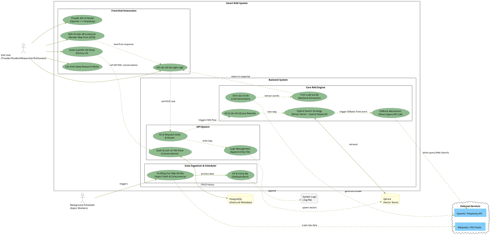

### 1.2. Architecture Component Diagram

**Mục đích:**
Biểu đồ này phân rã hệ thống thành các thành phần phần mềm chính (Logical Components) và mô tả cách chúng kết nối với nhau. Mục tiêu là cung cấp một bản thiết kế cấp cao về cấu trúc module, giúp lập trình viên hiểu rõ trách nhiệm của từng khối (Client, Gateway, Logic, Data) và các giao thức giao tiếp giữa chúng.

**Mô tả chi tiết:**

Hệ thống được thiết kế theo kiến trúc phân tầng (Layered Architecture), bao gồm 4 lớp chính:

1.  **Client Layer (Lớp Giao diện):**
    *   **React SPA (Single Page Application):** Chạy trên trình duyệt người dùng tại cổng `HTTP/3000`. Sử dụng Axios để gọi API và Leaflet để hiển thị bản đồ trực quan.

2.  **API Gateway / Backend Layer (Lớp Cổng):**
    *   **FastAPI Server:** Đóng vai trò là cổng vào duy nhất (Single Entry Point) tại cổng `HTTP/8000`. Chịu trách nhiệm định tuyến (Routing), xác thực, ghi log (Logging Middleware) và xử lý CORS trước khi chuyển request vào lớp Logic.

3.  **Application Logic Layer (Lớp Nghiệp vụ):**
    *   **RAG Controller:** Bộ não trung tâm điều phối luồng xử lý RAG.
    *   **Ingestion Pipeline:** Module chuyên biệt xử lý dữ liệu đầu vào (Crawl, Clean, Chunk).
    *   **AI Service Factory:** Áp dụng Factory Pattern để trừu tượng hóa việc khởi tạo các dịch vụ AI. Cho phép hệ thống linh hoạt chuyển đổi giữa các provider (OpenAI, Perplexity, Local) mà không ảnh hưởng đến code logic chính.

4.  **Data Persistence Layer (Lớp Lưu trữ):**
    *   **PostgreSQL (TCP/5432):** Lưu trữ dữ liệu có cấu trúc (Relational Data) như lịch sử hội thoại, tin nhắn.
    *   **Qdrant Vector DB (HTTP/6333):** Lưu trữ vector embeddings và metadata phục vụ tìm kiếm ngữ nghĩa.
    *   **File System:** Lưu trữ Logs hệ thống dưới dạng file `.log` (Append-only) để tối ưu hiệu suất ghi.

5.  **External Services (Dịch vụ Ngoài):**
    *   Kết nối tới các API bên ngoài như OpenAI, Perplexity và nguồn dữ liệu Wikipedia/RSS để làm giàu tri thức cho hệ thống.

***
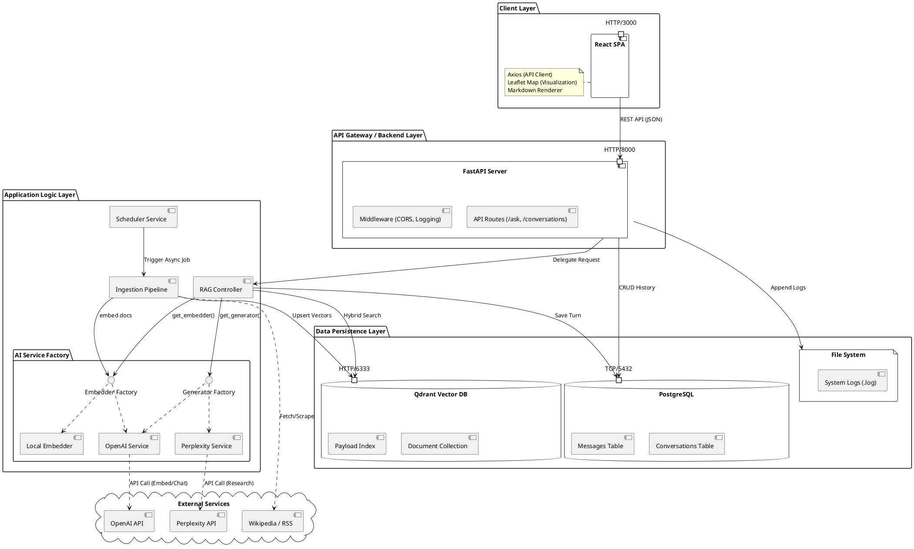

### 1.3. Interaction Overview Diagram

**Mục đích:**
Biểu đồ này cung cấp một cái nhìn tổng quát "từ trên cao" (helicopter view) về các luồng hoạt động chính (Workflows) của hệ thống. Nó giúp người đọc hiểu được sự phân tách rõ ràng giữa các quy trình tương tác thời gian thực (Real-time Interaction) với người dùng và các quy trình xử lý nền (Background Processing), đồng thời đóng vai trò như một bản đồ chỉ mục để tham chiếu đến các Sequence Diagram chi tiết hơn.

**Mô tả chi tiết:**

Hệ thống hoạt động dựa trên hai luồng xử lý song song và độc lập:

1.  **User Request Flow (Luồng Xử Lý Yêu Cầu Người Dùng):**
    *   Đây là luồng đồng bộ (Synchronous), bắt đầu khi người dùng gửi một câu hỏi qua API `/ask`.
    *   Quy trình bao gồm các bước kiểm tra tính hợp lệ (Validation), tải ngữ cảnh lịch sử (Context Loading), và tối ưu hóa câu hỏi (Query Rewrite) nếu cần thiết.
    *   Trọng tâm của luồng này là khối xử lý **RAG Logic**, nơi hệ thống thực hiện tìm kiếm và sinh câu trả lời. Chi tiết kỹ thuật của khối này được mô tả kỹ hơn trong biểu đồ tuần tự `DLD_Sequence_RAG_Detailed`.
    *   Cuối cùng, hệ thống định dạng câu trả lời kèm theo tọa độ địa lý và trả về JSON response cho Frontend.

2.  **Background Scheduler Flow (Luồng Lập Lịch Chạy Nền):**
    *   Đây là luồng bất đồng bộ (Asynchronous), được kích hoạt tự động bởi Cron Trigger (ví dụ: vào 2:00 sáng hàng ngày).
    *   Mục tiêu là tự động cập nhật và làm giàu cơ sở tri thức mà không ảnh hưởng đến trải nghiệm người dùng.
    *   Quy trình bao gồm khởi tạo pipeline, thực thi việc thu thập và vector hóa dữ liệu (**Ingestion Pipeline** - tham chiếu chi tiết tại `DLD_Sequence_Scheduler`), và cuối cùng là ghi log kết quả thành công hoặc báo lỗi.

***
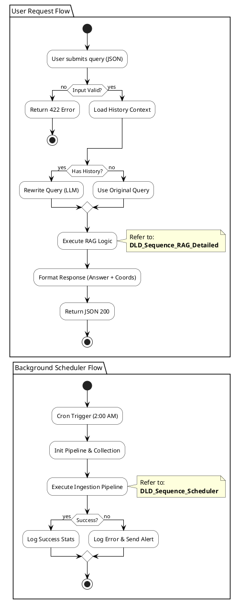

### 1.4. Deployment Diagram

**Mục đích:**
Biểu đồ này minh họa kiến trúc vật lý và môi trường triển khai (Infrastructure) của hệ thống. Nó giúp đội ngũ DevOps và System Admin hiểu rõ cách các thành phần phần mềm được đóng gói, phân bố trên hạ tầng mạng, và cách chúng giao tiếp với nhau cũng như với thế giới bên ngoài.

**Mô tả chi tiết:**

Hệ thống được triển khai theo mô hình Containerization sử dụng Docker, bao gồm 3 khu vực chính:

1.  **Client Side (Phía Người Dùng):**
    *   Trình duyệt web của người dùng chạy ứng dụng **React SPA** (Single Page Application).
    *   Ứng dụng này giao tiếp trực tiếp với Backend API qua giao thức HTTP/JSON (cổng 8000) và tải bản đồ từ dịch vụ **OpenStreetMap** (HTTPS) độc lập.

2.  **Host Server (Máy Chủ):**
    *   Môi trường chạy **Docker Engine**, quản lý một mạng nội bộ ảo (**Internal Docker Network - bridge**).
    *   Bên trong mạng này là các container dịch vụ cốt lõi:
        *   **Backend (FastAPI):** Xử lý logic chính, chạy server Uvicorn tại cổng 8000. Chứa cả Scheduler chạy in-process.
        *   **Crawler (Worker):** Container riêng biệt chạy các script thu thập dữ liệu nền.
        *   **Database (PostgreSQL):** Lưu trữ dữ liệu quan hệ tại cổng 5432.
        *   **Vector DB (Qdrant):** Lưu trữ vector tại cổng 6333.
    *   **Data Persistence:** Dữ liệu của PostgreSQL và Qdrant được ánh xạ ra ổ cứng máy chủ thông qua **Docker Volumes** (`pg_data`, `qdrant_data`) để đảm bảo an toàn dữ liệu khi container khởi động lại.

3.  **External Internet (Mạng Ngoài):**
    *   Hệ thống kết nối an toàn (HTTPS) tới các dịch vụ đám mây:
        *   **AI Services:** Gọi API của OpenAI và Perplexity để xử lý ngôn ngữ tự nhiên.
        *   **Data Sources:** Truy cập Wikipedia và RSS Feeds để thu thập dữ liệu mới.

***
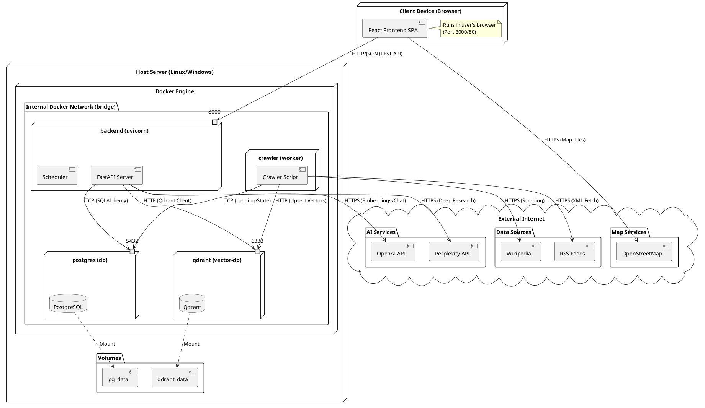

### 2.1. Package Diagram

**Mục đích:**
Biểu đồ này được sử dụng để tổ chức và trực quan hóa cấu trúc thư mục mã nguồn (Source Code Structure) của cả Frontend và Backend. Nó giúp quản lý các phụ thuộc (Dependencies) giữa các module, đảm bảo tuân thủ nguyên tắc thiết kế "High Cohesion, Low Coupling" (Kết dính cao, Phụ thuộc thấp).

**Mô tả chi tiết:**

1.  **Frontend_Src (React):**
    *   **fe_pages:** Chứa các trang chính như `ChatPage`. Đây là nơi kết hợp logic và giao diện.
    *   **fe_components:** Chứa các UI components tái sử dụng (`ChatInput`, `Message`, `MapView`). `MapView` quản lý trạng thái bản đồ độc lập.
    *   **fe_api:** Đóng gói toàn bộ logic gọi API (`askService`, `conversationService`) để tách biệt việc giao tiếp mạng khỏi logic hiển thị.
    *   **fe_utils:** Các tiện ích dùng chung như xử lý ngôn ngữ (`language`), sinh ID (`uuid`).

2.  **Backend_App (FastAPI):**
    *   **be_routes:** Định nghĩa các API endpoint (`AskRoute`, `ConversationsRoute`).
    *   **be_services:** Chứa logic nghiệp vụ cốt lõi, sử dụng **Factory Pattern** (`ServiceFactory`) để quản lý việc khởi tạo các implementation cụ thể của Embeddings và Generators (OpenAI, Local, Perplexity).
    *   **be_ingestion:** Module xử lý dữ liệu nền, bao gồm `IngestionPipeline` điều phối `Scraper` (thu thập) và `DataProcessor` (làm sạch, cắt nhỏ).
    *   **be_db:** Lớp truy cập dữ liệu (DAL), chứa `Models` (SQLAlchemy), `ConversationRepo` (Repository Pattern cho Postgres) và `QdrantClientWrapper`.

3.  **Mối quan hệ (Relationships):**
    *   Các mũi tên nét đứt (`..>`) thể hiện sự phụ thuộc. Ví dụ: `ChatPage` phụ thuộc vào `fe_api` để lấy dữ liệu.
    *   Đặc biệt, mũi tên "Cross System" thể hiện sự tương tác qua mạng giữa Frontend `askService` và Backend `AskRoute`.

***
```plantuml
@startuml DLD_Package_Detailed_Final
allowmixing

' ==========================================
' 1. FRONTEND DEFINITIONS
' ==========================================
package "Frontend_Src" {
    
    package "fe_api" {
        class askService {
            +askQuestion(prompt, role, model): Promise
            +getHealth(): Promise
        }
        class conversationService {
            +listConversations(limit, offset): Promise
            +getMessages(convId): Promise
            +deleteConversation(convId): Promise
        }
    }

    package "fe_components" {
        class ChatInput {
            +handleSend()
            +handleKeyDown()
        }
        class Message {
            +renderMarkdown()
            +renderSources()
        }
        class MapView {
            +state: viewState
            +renderMarkers()
        }
        class ConversationHistory {
            +onSelect()
            +onDelete()
        }
    }

    package "fe_pages" {
        class ChatPage {
            -messages: Array
            -loading: Boolean
            +handleAsk()
            +useEffect()
        }
    }

    package "fe_utils" {
        class uuid {
            +v4(): String
        }
        class language {
            +detect(text): String
        }
    }
}

' ==========================================
' 2. BACKEND DEFINITIONS
' ==========================================
package "Backend_App" {

    package "be_config" {
        class Settings {
            +QDRANT_URL: str
            +OPENAI_API_KEY: str
            +POSTGRES_URL: str
        }
    }

    package "be_routes" {
        class AskRoute {
            +post_ask(request): Response
        }
        class ConversationsRoute {
            +get_list(limit): List
            +post_create(title): Dict
        }
    }

    package "be_db" {
        class ConversationRepo {
            +get_or_create(id): Conv
            +save_turn(id, q, a): void
        }
        class QdrantClientWrapper {
            +search(vector): List
            +upsert(points): void
        }
        class Models {
            +Conversation(Base)
            +Message(Base)
        }
    }

    package "be_services" {
        class ServiceFactory {
            +get_embedder(): BaseEmbedder
            +get_generator(): BaseGenerator
        }
        
        package "impl_embeddings" {
            class OpenAIEmbedder {
                +embed_text(str): List[float]
            }
            class LocalEmbedder {
                +embed_text(str): List[float]
            }
        }
        
        package "impl_generators" {
            class OpenAIGenerator {
                +generate(prompt): str
            }
            class PerplexityGenerator {
                +generate(prompt): str
            }
        }
    }

    package "be_ingestion" {
        class IngestionPipeline {
            +run_daily_crawl()
            +process_article(url)
        }
        class DataProcessor {
            +clean_text(str): str
            +chunk_text(str): List
        }
        class Scraper {
            +fetch_wiki(topic): Dict
            +fetch_rss(url): List
        }
    }
    
    package "be_utils" {
        class ContextManager {
            +build_prompt(history, docs): str
        }
    }
}

' ==========================================
' 3. RELATIONSHIPS
' ==========================================

' Frontend Internal
ChatPage ..> askService
ChatPage ..> conversationService
ChatPage ..> fe_components
ChatPage ..> fe_utils

' Backend Internal
AskRoute ..> ServiceFactory
AskRoute ..> ConversationRepo
AskRoute ..> ContextManager

ConversationsRoute ..> ConversationRepo
ConversationRepo ..> Models

IngestionPipeline ..> Scraper
IngestionPipeline ..> DataProcessor
IngestionPipeline ..> QdrantClientWrapper
IngestionPipeline ..> ServiceFactory

ServiceFactory ..> impl_embeddings
ServiceFactory ..> impl_generators

' Cross System (API Calls)
askService ..> AskRoute : HTTP POST /ask
conversationService ..> ConversationsRoute : HTTP GET/POST

@enduml
```

### 2.2. Class Diagram

**Mục đích:**
Biểu đồ Class Diagram này đóng vai trò "xương sống" cho toàn bộ thiết kế Backend, định nghĩa chi tiết các lớp (Classes), thuộc tính (Fields), phương thức (Methods) và mối quan hệ giữa chúng. Nó giúp đội ngũ phát triển hiểu rõ cấu trúc hướng đối tượng (OOP), các mẫu thiết kế (Design Patterns) được áp dụng để đảm bảo tính linh hoạt, tái sử dụng và dễ bảo trì của mã nguồn.

**Mô tả chi tiết:**

Biểu đồ được chia thành các gói (Package) logic tương ứng với các tầng của hệ thống:

1.  **Configuration:**
    *   **Settings:** Lớp trung tâm quản lý toàn bộ cấu hình hệ thống (biến môi trường), từ thông tin kết nối Database (`QDRANT_URL`, `POSTGRESQL_URL`) đến các khóa API (`OPENAI_API_KEY`).

2.  **Core Services (Abstract) & Implementation:**
    *   Áp dụng **Strategy Pattern** thông qua các lớp trừu tượng `BaseEmbedder` và `BaseGenerator`.
    *   Các lớp cụ thể (`LocalEmbedder`, `OpenAIEmbedder`, `OpenAIGenerator`, `PerplexityGenerator`) thực thi các interface này, cho phép hệ thống dễ dàng thay đổi nhà cung cấp AI mà không ảnh hưởng đến logic nghiệp vụ.

3.  **Factory Pattern:**
    *   **ServiceFactory:** Chịu trách nhiệm khởi tạo các đối tượng Embedder và Generator dựa trên cấu hình. Điều này giúp tách biệt logic khởi tạo phức tạp khỏi logic sử dụng.

4.  **Business Logic (RAG):**
    *   **RAGController:** Lớp điều phối chính, kết nối các service để xử lý yêu cầu hỏi đáp. Nó quản lý luồng từ lúc nhận câu hỏi, rewrite, tìm kiếm, đến khi sinh câu trả lời.
    *   **HybridSearchEngine:** Đóng gói logic tìm kiếm phức tạp (Dense + Sparse + RRF Fusion), giúp `RAGController` gọn gàng hơn.

5.  **Data Ingestion:**
    *   Các lớp như `EnhancedIngestionPipeline`, `AutoCrawler`, `DataProcessor`, `DeduplicationManager` phối hợp để tạo thành một quy trình xử lý dữ liệu tự động, mạnh mẽ và có khả năng mở rộng.

6.  **Data Access Layer:**
    *   **ConversationRepository:** Áp dụng **Repository Pattern** để trừu tượng hóa các thao tác database, cung cấp API sạch sẽ cho lớp Business Logic (`create`, `save_turn`, `get_messages`).
    *   **Models:** Định nghĩa cấu trúc dữ liệu (`Conversation`, `Message`) tương ứng với các bảng trong PostgreSQL.

***
```plantuml
@startuml DLD_Class_Full_Detail
skinparam classAttributeIconSize 0
skinparam linetype ortho

package "Configuration" {
    class Settings {
        +APP_NAME: str
        +QDRANT_HOST: str
        +QDRANT_PORT: int
        +QDRANT_URL: str
        +QDRANT_API_KEY: str
        +COLLECTION_NAME: str
        +VECTOR_SIZE: int
        +EMBEDDING_PROVIDER: str
        +OPENAI_API_KEY: str
        +OPENAI_EMBEDDING_MODEL: str
        +LOCAL_EMBEDDING_MODEL: str
        +LLM_PROVIDER: str
        +OPENAI_CHAT_MODEL: str
        +PERPLEXITY_API_KEY: str
        +PERPLEXITY_MODEL: str
        +MAX_CONTEXT_DOCS: int
        +POSTGRESQL_URL: str
        +__init__(**kwargs)
    }
}

package "Core Services (Abstract)" {
    abstract class BaseEmbedder {
        +{abstract} embed_text(text: str): List[float]
    }

    abstract class BaseGenerator {
        +{abstract} generate(prompt: str, system: str, enable_web_search: bool): Dict[str, Any]
    }
}

package "Service Implementation" {
    class LocalEmbedder {
        -_lock: threading.Lock
        -_model_instance: SentenceTransformer
        +__init__(model_name: str, device: str)
        +embed_text(text: str): List[float]
        +embed_texts(texts: List[str]): List[List[float]]
    }

    class OpenAIEmbedder {
        -client: OpenAI
        -model: str
        +__init__()
        +embed_text(text: str): List[float]
    }

    class OpenAIGenerator {
        -client: OpenAI
        -default_model: str
        -premium_model: str
        +__init__()
        +generate(prompt: str, system: str, enable_web_search: bool): dict
    }

    class PerplexityGenerator {
        -client: Perplexity
        -default_model: str
        -web_model: str
        +__init__()
        +generate(prompt: str, system: str, enable_web_search: bool): dict
    }
    
    class ExternalSearchService {
        +{static} get_external_docs(query: str, embedder): List[dict]
    }
}

package "Factory Pattern" {
    class ServiceFactory {
        +{static} get_embedder(): BaseEmbedder
        +{static} get_generator(provider: str): BaseGenerator
    }
}

package "Business Logic (RAG)" {
    class RAGController {
        -embedder: BaseEmbedder
        -generator: BaseGenerator
        -repo: ConversationRepository
        +ask(req: AskRequest): AskResponse
        -rewrite_query_with_context(current_query: str, history: List, generator): str
        -build_unified_prompt(user_question, conversation_context, documents, role, ...): str
        -extract_all_coordinates(text: str): List[dict]
        -add_coordinates_to_answer(answer: str, coordinates: List): str
        -save_fallback_answer_to_qdrant(query: str, answer: str, embedder)
    }
    
    class HybridSearchEngine {
        +{static} search_similar_hybrid(query_vector, query_text, limit): List[dict]
        +{static} search_similar(query_vector, limit): List[dict]
        -{static} reciprocal_rank_fusion(dense_results, sparse_results, k): List[dict]
    }
}

package "Data Ingestion" {
    class EnhancedIngestionPipeline {
        -wiki_scraper: WikipediaScraper
        -web_scraper: WebScraper
        -processor: DataProcessor
        -qdrant: QdrantClient
        +stats: Dict
        +__init__()
        +ingest_phase_1_historical_foundation(limit, auto_discover, max_per_category)
        +ingest_rss_feeds()
        +ingest_articles(articles: List, source_name: str)
        +ingest_wikipedia(topics: List)
        -_save_to_qdrant(chunks: List)
        -_print_stats()
    }
    
    class AutoCrawler {
        -wiki_scraper: WikipediaScraper
        +__init__()
        +discover_new_articles(max_per_category, known_titles): List[str]
    }
    
    class DataProcessor {
        -embedder: SentenceTransformer
        -dedup: DeduplicationManager
        +__init__(model_name)
        +clean_text(text: str): str
        +chunk_text(text: str, chunk_size, overlap): List[str]
        +process_article(article: Dict): List[Dict]
    }
    
    class DeduplicationManager {
        -qdrant: QdrantClient
        -ingested_titles: Set[str]
        -ingested_hashes: Set[str]
        +__init__()
        -_load_existing_data()
        +{static} generate_content_hash(text, title): str
        +is_duplicate(article: Dict): bool
        +mark_as_ingested(article: Dict)
        +get_stats(): Dict
    }
    
    class WikipediaScraper {
        -wiki: Wikipedia
        +__init__()
        +get_category_members_page(category, limit): Tuple[List, str]
        +fetch_articles(titles: List): List[Dict]
    }
    
    class WebScraper {
        +fetch_rss(url: str): List[Dict]
    }
}

package "Data Access Layer" {
    class ConversationRepository {
        +create_conversation(id, title, metadata): Dict
        +get_or_create_conversation(id, title, metadata): Dict
        +save_message(conv_id, role, content, sources, metadata): Dict
        +save_turn(conv_id, user_query, assistant_answer, sources)
        +get_conversation(conv_id): Optional[Dict]
        +get_messages(conv_id, limit, offset): List[Dict]
        +get_recent_messages(conv_id, limit): List[Dict]
        +list_conversations(limit, offset, order_by): List[Dict]
        +update_conversation(conv_id, title, metadata): bool
        +delete_conversation(conv_id): bool
        +delete_messages(conv_id): int
        +search_conversations(query, limit): List[Dict]
        +get_conversation_count(): int
        +get_message_count(conv_id): int
    }

    class Conversation {
        +id: String [PK]
        +title: String
        +created_at: DateTime
        +updated_at: DateTime
        +meta_data: JSONB
        +messages: relationship
        +to_dict(): Dict
    }

    class Message {
        +id: UUID [PK]
        +conversation_id: String [FK]
        +role: String
        +content: Text
        +sources: JSONB
        +created_at: DateTime
        +meta_data: JSONB
        +conversation: relationship
        +to_dict(): Dict
    }
}

' --- Relationships ---
BaseEmbedder <|-- LocalEmbedder
BaseEmbedder <|-- OpenAIEmbedder
BaseGenerator <|-- OpenAIGenerator
BaseGenerator <|-- PerplexityGenerator

ServiceFactory ..> Settings : reads
ServiceFactory ..> BaseEmbedder : creates
ServiceFactory ..> BaseGenerator : creates

RAGController --> ServiceFactory : uses
RAGController --> HybridSearchEngine : uses
RAGController --> ConversationRepository : uses
RAGController ..> ExternalSearchService : fallback call

EnhancedIngestionPipeline --> AutoCrawler : uses
EnhancedIngestionPipeline --> DataProcessor : uses
EnhancedIngestionPipeline --> WebScraper : uses
EnhancedIngestionPipeline --> WikipediaScraper : uses
AutoCrawler --> WikipediaScraper : uses

DataProcessor --> DeduplicationManager : uses

ConversationRepository --> Conversation : manages
Conversation "1" *-- "many" Message : contains

@enduml
```

### 2.3. Sequence Diagrams (Dynamic Behavior)

Sequence Diagrams minh họa chi tiết cách các đối tượng trong hệ thống tương tác với nhau theo trình tự thời gian để thực hiện một chức năng cụ thể. Đây là phần "Dynamic View" bổ trợ cho "Static View" (Class Diagram).

#### A. RAG & Search Logic (Main Flow)

**Mục đích:**
Minh họa luồng xử lý cốt lõi của hệ thống khi nhận được câu hỏi từ người dùng. Biểu đồ này làm rõ sự phức tạp của việc kết hợp RAG (Retrieval-Augmented Generation), Hybrid Search và cơ chế Fallback.

**Mô tả các bước (Flow Description):**

1.  **Step 1: Context & Rewrite:** Hệ thống không trả lời ngay mà tải lịch sử hội thoại (`Repo`) và dùng LLM để viết lại câu hỏi (`rewrite_query_with_context`). Điều này giúp xử lý các câu hỏi phụ thuộc ngữ cảnh như "Nó ở đâu?" thành "Tháp Eiffel ở đâu?".
2.  **Step 2: Embedding:** Câu hỏi đã viết lại được chuyển thành vector số học (`embed_text`).
3.  **Step 3: Hybrid Retrieval:** Hệ thống tìm kiếm song song:
    *   **Dense Search:** Tìm theo vector (ý nghĩa) trong Qdrant.
    *   **Sparse Search:** Tìm theo từ khóa (keyword).
    *   **RRF Fusion:** Trộn hai kết quả lại để có danh sách tài liệu tốt nhất (`reciprocal_rank_fusion`).
4.  **Step 4: Fallback Logic:** Đây là điểm thông minh của hệ thống. Nếu kết quả tìm được quá ít (ví dụ < 2 tài liệu), hệ thống tự động gọi `ExternalSearchService` (Wikipedia/Web) để tìm kiếm thêm, tránh việc trả lời "Tôi không biết".
5.  **Step 5: Generation & Extraction:** LLM sinh câu trả lời dựa trên tài liệu tổng hợp. Sau đó, hệ thống phân tích câu trả lời để trích xuất tọa độ địa lý (`extract_all_coordinates`), phục vụ hiển thị bản đồ.
6.  **Step 6: Persistence:** Lưu toàn bộ lượt hỏi-đáp vào Database để làm lịch sử cho các câu hỏi sau.

***
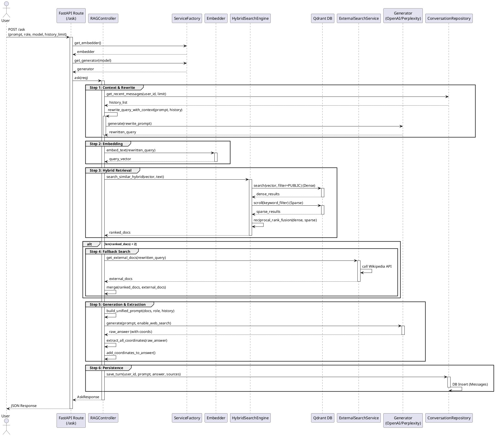

#### B. History Management Flow

**Mục đích:**
Minh họa chi tiết các thao tác CRUD (Create, Read, Update, Delete) đối với thực thể Hội thoại (Conversation) và Tin nhắn (Messages). Đây là phần logic nền tảng để Frontend xây dựng giao diện "Chat History" giống như ChatGPT.

**Mô tả các bước (Flow Description):**

1.  **Create Conversation:** Khi người dùng bắt đầu phiên mới, Frontend gửi yêu cầu tạo hội thoại. Backend kiểm tra xem ID đã tồn tại chưa (`get_or_create_conversation`). Nếu chưa, nó chèn bản ghi mới vào PostgreSQL.
2.  **List Conversations:** Để hiển thị sidebar lịch sử, hệ thống lấy danh sách hội thoại được sắp xếp theo thời gian cập nhật gần nhất (`ORDER BY updated_at DESC`). Nó cũng lấy trước một đoạn tin nhắn ngắn (preview) để hiển thị.
3.  **Get Messages:** Khi người dùng click vào một hội thoại cũ, hệ thống tải toàn bộ tin nhắn của hội thoại đó, sắp xếp theo trình tự thời gian (`ORDER BY created_at`) để tái hiện lại cuộc trò chuyện.
4.  **Delete Conversation:** Khi người dùng xóa một hội thoại, Backend thực hiện xóa cứng (Hard Delete) bản ghi trong bảng `conversations`. Quan trọng là cơ sở dữ liệu được cấu hình `Cascade Delete`, nghĩa là tất cả tin nhắn thuộc hội thoại đó cũng sẽ tự động bị xóa theo, đảm bảo tính toàn vẹn dữ liệu.

***
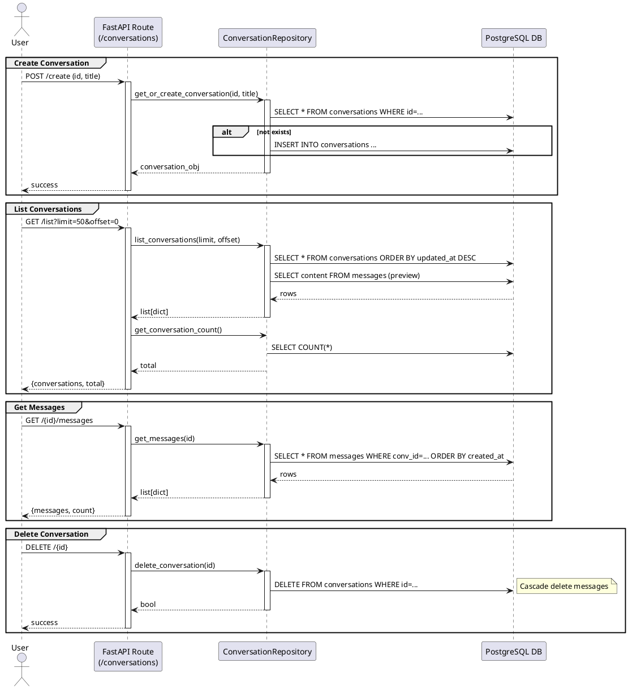

### 2.4. State Machine Diagrams (Lifecycle & States)

Biểu đồ trạng thái (State Machine) bổ sung góc nhìn sâu sắc về cách hệ thống phản ứng với các sự kiện và chuyển đổi trạng thái nội bộ, đặc biệt quan trọng đối với các quy trình có tính chất tuần tự phức tạp hoặc có khả năng xảy ra lỗi.

#### A. Data Ingestion Pipeline State

**Mục đích:**
Mô hình hóa toàn bộ vòng đời của một tác vụ thu thập dữ liệu (ETL Job), từ khi "ngủ yên" (Idle) đến khi hoàn tất việc lưu trữ vector. Biểu đồ này giúp lập trình viên xử lý chính xác các tình huống ngoại lệ (như mất kết nối DB) và logic nghiệp vụ (như trùng lặp dữ liệu).

**Mô tả các trạng thái (State Transitions):**

1.  **Idle & Triggering:** Hệ thống ở trạng thái chờ. Nó có thể được đánh thức bởi Cron Job (tự động) hoặc API Call (thủ công).
2.  **Initialization:** Bước kiểm tra sức khỏe ban đầu. Nếu Qdrant chưa sẵn sàng, quy trình sẽ dừng ngay lập tức và quay về Idle để tránh lãng phí tài nguyên.
3.  **Discovery Phase:** Quét tìm dữ liệu mới. Trạng thái `Title Filtering` quyết định xem có tiếp tục sang bước Fetching hay không. Nếu không có bài mới, quy trình kết thúc sớm (Early Exit).
4.  **Processing Phase:** Đây là "hộp đen" xử lý dữ liệu.
    *   `Deduplication Check`: Cổng chặn quan trọng để loại bỏ dữ liệu rác/trùng lặp.
    *   Chuỗi `Cleaning` -> `Chunking` -> `Embedding`: Biến đổi dữ liệu thô thành vector.
5.  **Storage Phase:** Ghi dữ liệu vào Qdrant. Đặc biệt có trạng thái `RetryLogic` để xử lý lỗi mạng tạm thời (Transient Errors), tăng độ ổn định cho hệ thống.
6.  **Finalization:** Cập nhật thống kê và đánh dấu hoàn thành trước khi quay về trạng thái nghỉ.

***
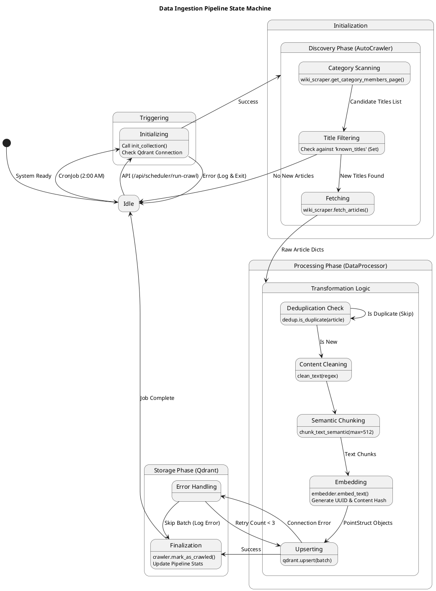

#### B. API Request Lifecycle (/ask)

**Mục đích:**
Minh họa chi tiết các trạng thái mà một request `/ask` trải qua bên trong Backend. Biểu đồ này cực kỳ hữu ích để debug và hiểu rõ các điểm quyết định (Decision Points) quan trọng trong logic RAG.

**Mô tả các trạng thái (State Transitions):**

1.  **Input Validation:** Cổng kiểm soát đầu tiên. Request không hợp lệ (sai format, thiếu field) sẽ bị từ chối ngay lập tức (`Rejected`) trả về 422.
2.  **Context Management:** Trạng thái xử lý ngữ cảnh. Điểm quyết định `QueryAnalysis` xác định xem câu hỏi có cần được viết lại (Rewrite) dựa trên lịch sử hay không. Đây là chìa khóa để xử lý các hội thoại tự nhiên.
3.  **Retrieval Strategy:** Trái tim của RAG.
    *   Sau khi Embedding và Searching, hệ thống kiểm tra chất lượng kết quả tại điểm `doc_check`.
    *   Nếu tìm thấy ít tài liệu (`Docs < 2`), hệ thống chuyển sang trạng thái `Fallback` để tìm kiếm bên ngoài (Wikipedia), đảm bảo luôn có thông tin để trả lời.
4.  **Generation Phase:** Chuẩn bị Prompt (đưa context, role vào) và gọi LLM. Nếu API LLM lỗi, hệ thống chuyển sang `ErrorHandler` để trả về 500 một cách an toàn.
5.  **Post-Processing:** Sau khi có câu trả lời thô, hệ thống trích xuất tọa độ và lưu trữ đoạn hội thoại (`Persisting`) trước khi đóng gói JSON response.

***
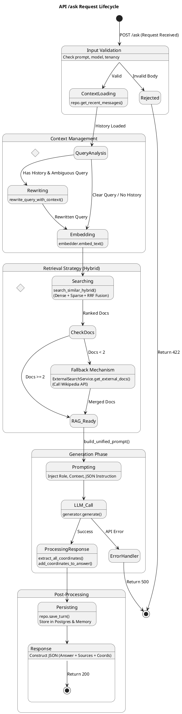

#### C. Conversation Entity Lifecycle

**Mục đích:**
Mô tả vòng đời tồn tại của dữ liệu "Hội thoại" (Conversation) trong cơ sở dữ liệu. Biểu đồ này làm rõ các quy tắc nghiệp vụ về thời điểm tạo mới, cập nhật tiêu đề tự động và cơ chế xóa dữ liệu.

**Mô tả các trạng thái (State Transitions):**

1.  **Transient (Memory Only):** Khi người dùng mới mở trang web, một `conversation_id` (UUID) được sinh ra nhưng **chưa** được lưu vào Database. Nó chỉ tồn tại trong RAM của trình duyệt (Client State). Điều này giúp tránh tạo ra hàng ngàn bản ghi rác nếu người dùng thoát ngay mà không chat.
2.  **Persistent (Database):**
    *   **Creation Logic:** Ngay khi tin nhắn đầu tiên được gửi, hệ thống mới thực sự `INSERT` vào bảng Conversations. Tiêu đề hội thoại (`Title`) được tự động sinh bằng cách lấy 100 ký tự đầu của câu hỏi.
    *   **Active State:** Đây là trạng thái sống chính. Mỗi lượt hỏi đáp sẽ chèn thêm 2 bản ghi vào bảng Messages (User & Assistant) và cập nhật cột `updated_at` của bảng Conversation để nó nổi lên đầu danh sách.
    *   **Retrieval:** Khi người dùng xem lại lịch sử, dữ liệu được query ra (`SELECT`) nhưng trạng thái không đổi.
    *   **Modification:** Người dùng có thể đổi tên (Rename) hoặc xóa nội dung (Clear Context) nhưng vẫn giữ lại vỏ hội thoại.
3.  **Termination:** Khi người dùng chọn "Delete Chat", hệ thống thực hiện **Hard Delete**. Nhờ ràng buộc khóa ngoại (Foreign Key) với `ON DELETE CASCADE`, toàn bộ tin nhắn bên trong cũng sẽ biến mất vĩnh viễn, đảm bảo không còn dữ liệu mồ côi (Orphan Data).

***
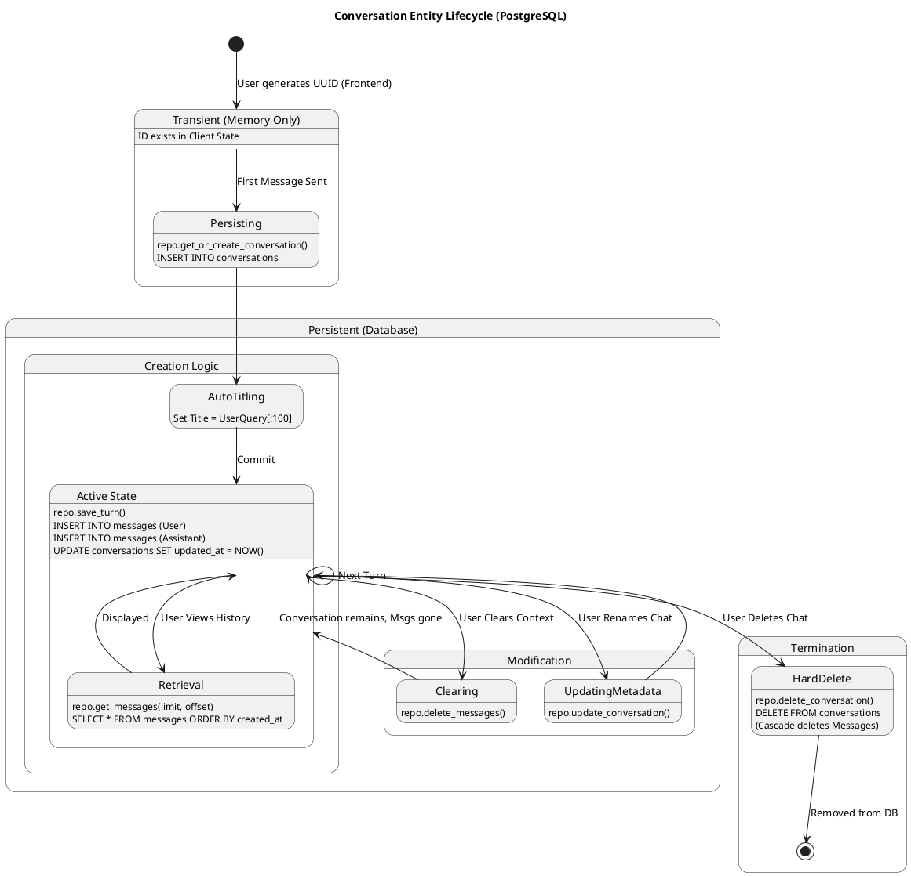